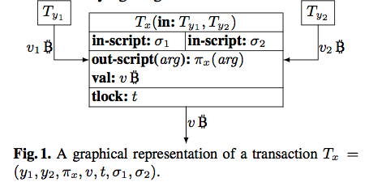
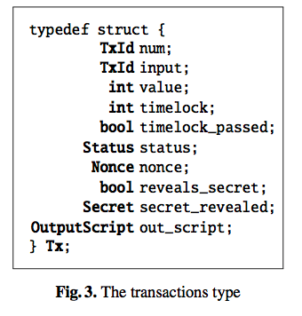
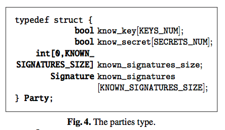
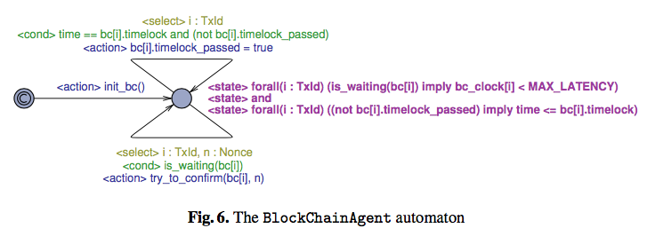
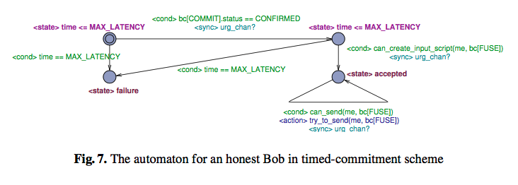
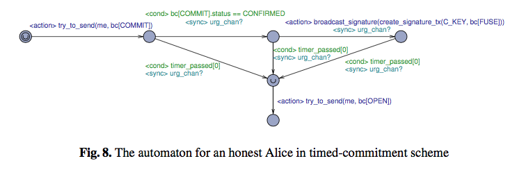
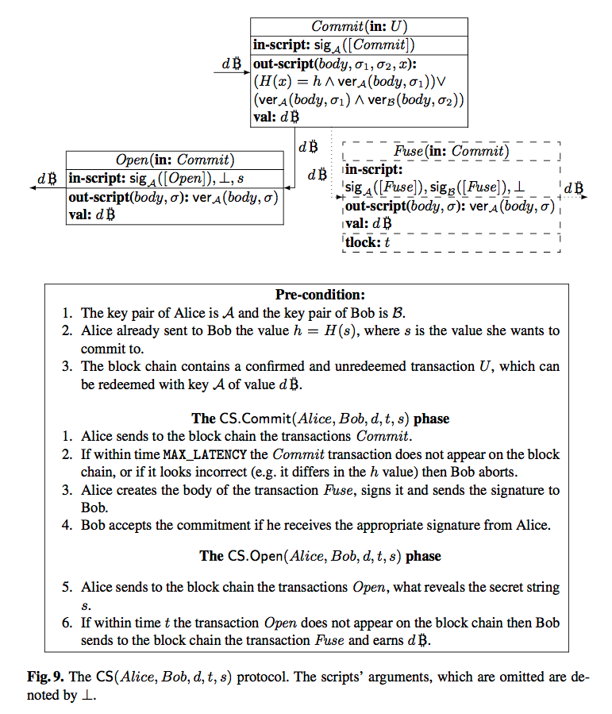
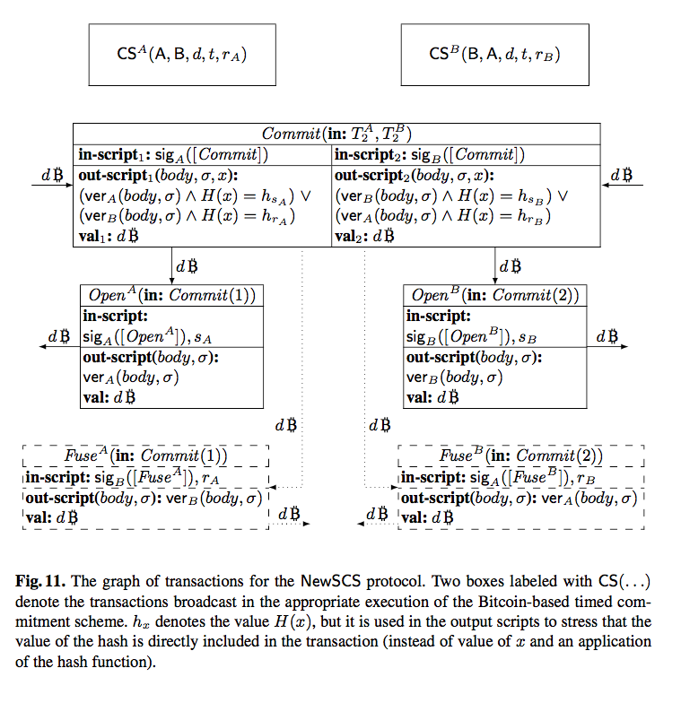
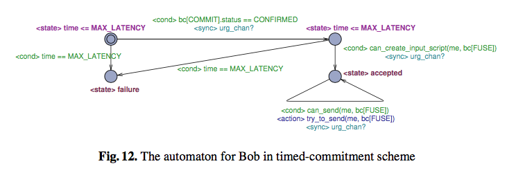
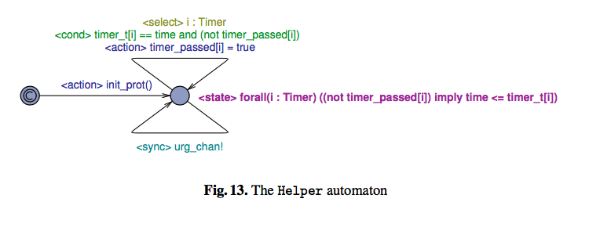

This document is the Korean translation of [Modeling Bitcoin contracts by Timed Automata](https://arxiv.org/abs/1405.1861), translated by BlockchainOS DevTeam. 
We give thanks to author ; Marcin Andrychowicz, Stefan Dziembowski, Daniel Malinowski and Łukasz
Mazurek, from [Cryptology and Data Security Group](http://www.crypto.edu.pl/) In University of Warsaw that give permission of the translation of this paper.
___

# 초록

비트코인은 P2P 암호화 화폐 시스템이다. 2008년 도입된 이래, 비트코인은 크게 다음 2가지 특징으로 인해 괄목할 만한 인기를 얻었다: (1) 거래수수료가 매우 낮다. (2) 중앙당국에 의해 통제 받지 않기 때문에 특히, 누구도 화폐를 “찍어내어” 인플레이션을 유발할 수 없다. 또한, 비트코인의 거래 구문(syntax)에 따라 계약이라는 걸 만들어낼 수 있는데 이 계약에서는 상호 불신하는 다수의 당사자들이 프로토콜에 참여하여 특정 금융업무를 공동으로 수행하며 이러한 과정의 공정성은 비트코인의 여러 특징에 의해 보장된다. 비트코인 계약이 디지털 경제에서 여러 잠재적 적용례를 가질 수 있음에도 지금까지는 현실에서 광범위하게 활용되지 못했다. 그 부분적인 이유는 비트코인을 만들어 내고 분석하는 일이 번거로워 사용하는 데도 위험이 따르기 때문이다.

본 논문에서 우리는 하드웨어 및 소프트웨어 시스템들 특히, 타임드 오토마타에 기반한 시스템들을 위한 컴퓨터 이용(computer-aided) 분석을 목적으로 원래 개발된 방법들을 이용해 이 문제를 해결하려 한다. 보다 구체적으로, 우리는 UPPAAL model checker에서 타임드 오토마타를 이용한 비트코인 계약 모델링용 한 프레임워크를 제안한다. 우리의 방식은 일반적인 것으로 여러 가지 계약을 모델링하는 데 이용될 수 있다. 개념증명으로서, 우리는 이 프레임워크를 이용하여 우리의 최근 논문에 제시된 비트코인 계약들 중 일부를 모델링한다. 그러고 나서 우리는 이들의 보안성을 UPPAAL에서 자동 검증하여 수동 분석으로는 감지하기 어려웠던 몇몇 미묘한 오류들을 발견(및 수정)한다. 우리는 본 논문으로 인해 정형 모델링 연구원들이 비트코인 계약 검증 문제에 관심을 가지게 되고 이 주제에 관한 더 많은 연구가 이루어질 수 있기를 바란다.

# 도입부

비트코인이란 2008년 “사토시 나카모토”[23]라는 필명을 쓰는 한 익명의 개발자에 의해 도입된 디지털 화폐 시스템이다. 이러한 불가사의한 기원에도 불구하고, 비트코인은 광범위하게 도입된 첫 암호화 화폐가 되었고 2014년 1월 현재 비트코인 자본환원가치는 70억 유로에 달한다. 비트코인의 엄청난 성공은 언론에서도 널리 보도되었고([16, 5, 25, 21, 22] 참조) 심지어 몇몇 감독기구나 미국 상원[21]을 포함한 입법기관들의 주목을 끌기까지 했다. 비트코인이 인기를 얻는 주된 요인들로는 중앙당국의 통제를 받지 않고, 거래수수료가 매우 낮고, 특히 유통되는 코인량이 한정되어 누구도 화폐를 “찍어내어” 인플레를 유발할 수 없다는 점들을 들 수 있다. 참여자들 간의 금융거래는 화폐 시스템 사용자들이 공동으로 유지하는 공개 원장을 통해 공시된다.

매우 흥미로우면서도 다소 잘 알려지지 않은 비트코인의 특징 중 하나는 비트코인이 참여자들 간의 단순한 송금보다 더욱 복잡한 “거래”를 가능케 해준다는 점이다. 아주 사사로이, 비트코인에서는 일정 금액의 돈을 “예탁”하여 특정 조건 하에서만 청구될 수 있게 하는 것이 가능하다. 이러한 조건은 비트코인 스크립트의 형태로 작성되며 특히 일정한 타이밍 제약을 수반할 수도 있다. 이러한 특징은 계약[27]이라는 것을 체결할 수 있게 해주며 이 계약에서는 다수의 상호 불신하는 당사자들이 비트코인 기반 프로토콜에 참여하여 일정한 업무를 공동으로 수행한다. 이 프로토콜의 보안은 순전히 비트코인 특징들에 의해 보장되며 추가적인 신뢰 가정이 전혀 필요 없다. 이러한 비트코인의 특징은 디지털 경제에서 보증계약 체결, 에스크로 및 분쟁중재, 신속한 소액결제[27], 다자간 복권[8] 등 여러 적용례를 가질 수 있다. 또한 이러한 비트코인의 특징은 사용자 인증[17] 혹은 거래의 익명성[19] 증진을 목적으로 한 안전한 “믹서” 구축 등 비트코인에 몇몇 특징들을 추가하는 데도 이용될 수 있다. 이러한 가능성은 언론에서까지 주목한 바있다(CNN Money의 최근 한 열광적인 기사 참조[22]).

우리 견해로, 이러한 비트코인의 특징이 비트코인 공동체에 의해 널리 활용되지 못하게 하는 방해요소 중 하나는 계약을 작성하고 이해하기가 까다롭다는 점이다. 사실 이 점 때문에 수많은 잠재적 적용례를 가지고 있음에도 불구하고 비트코인이 현실에서 널리 활용되지 못하고 있는지도 모른다. 우리가 경험한 바로는[6, 7, 8], 이러한 계약을 작성하는 일은 다음 이유들 때문에 어렵다. 첫째, 감지하기 힘든 미묘한 실수들을 스크립트상에 범하기 쉽다. 둘째, 여러 당사자와 타이밍 제약을 수반하는 프로토콜은 자연히 수동으로는 분석하기 어렵다. 계약상 존재하는 실수는 금전적 이득을 목적으로 악의적인 당사자에 의해 이용될 수 있기 때문에 사용자들이 이러한 비트코인의 특징을 현재로써 이용하기를 꺼려하는 것은 당연한 일이다.

본 논문에서 우리는 안전한 비트코인 계약 설계를 도울 수 있는 한 접근법을 제안한다. 우리의 발상은 하드웨어 및 소프트웨어 시스템 특히, 타임드 오토마타[1, 2]를 위한 컴퓨터 이용(computer-aided) 분석을 목적으로 원래 개발된 방법들을 이용하는 것이다. 이러한 방법들이 본 목적에 적합한 툴로 보이는 이유는 비트코인 계약에 사용되는 프로토콜들이 보통 상태의 수가 유한하고 시간개념에 의존하기 때문이다. 이러한 시간의존성은 두 부분으로 나뉜다: (1) 비트코인 거래가 컨펌되려면 일정한 시간이 걸린다(예를 들어, 1시간), (2) 비트코인 거래는 거래가 유효해지는 시간을 특정하는 “타임 록”을 수반할 수 있다.

## 우리의 공헌

우리는 UPPAAL model checker[9, 18]에서 타임드 오토마타를 이용한 비트코인 계약 모델링을 위한 한 프레임워크를 제안한다(section 2에서 기술). 우리의 방식은 일반적인 것이며 여러 다양한 계약을 모델링하는 데 활용될 수 있다. 개념증명으로서, section 3에서 우리는 이 프레임워크를 이용하여 우리의 이전 논문[8, 6]에 제시한 2가지 비트코인 계약을 모델링한다. 여기서는 수동으로 행해지지만 우리 방식은 상당히 일반적인 것으로 자동화될 가능성도 있다. 특히, 우리의 구현에 있어 대부분의 코드는 검증되는 프로토콜에 의존하는 것이 아닌 비트코인 시스템의 특징들을 기술하는 것이다. 하나의 새로운 계약을 모델링하기 위해서는 계약 내에서 이용되는 거래, 프로토콜 초반부 당사자들의 지식, 당사자들이 따르는 프로토콜만 명시하면 충분하다. 그러고 나서 UPPAAL에서 우리 계약의 보안성을 자동 검증한다(section 3.1). 우리가 계약 모델링 및 검증에 사용한 UPPAAL 코드는 crypto.edu.pl에서 얻을 수 있다.

## 추후 논문

우리는 본 논문으로 인해 정형 모델링 연구원들이 비트코인 계약 검증 문제에 관심을 가지게 되고 이 주제에 관한 더 많은 연구가 이루어질 수 있기를 바란다. 특히나 흥미롭게 다가오는 것은 이러한 검증과정을 완전 자동화하는 것이다. 하나의 매력적인 옵션으로 다음과 같은 작업흐름을 생각해볼 수 있다: (1) 비트코인 계약 설계자가 UPPAAL(혹은 확장된 UPPAAL 형태)에서 그 계약에 대해 기술한다, (2) 그가 이 이상화한 기술의 보안성을 UPPAAL을 이용하여 검증한다, (3) 이 이상화한 기술이 정확히 검증되면, 해당 시스템을 이용, 이를 “컴파일”하여 현실에서 활용될 수 있는 실제 비트코인 구현물로 만든다. 또 다른 옵션으로는 비트코인 계약 설계용 특수툴을 구축하여 다음 2가지 결과를 얻는 것이다: (a) UPPAAL 언어(검증용)로 된 코드, (b) 실제 비트코인 구현물.

물론, 위 2가지 옵션의 경우 모두에서, 이러한 검증과정의 견실성을 정식으로 증명해야 할 것이다(특히, “컴파일된” 코드가 이상화된 기술의 특징들을 유지한다는 것을). 따라서, 이러한 프로젝트는 비자명 이론 및 엔지니어링 작업 둘 모두를 필요로 할 것이다.

## 서두

임드 오토마타는 Alur와 Dill[1, 2]에 의해 도입되었고, 이 이론에 기초한 Kronos[31]와 Times[4] 같은 다른 model checker들도 존재한다. 이들을 이용하여 우리 아이디어를 구현하는 것 또한 흥미로울 것이다. 실시간 개념을 수반하는 기타 정식 모델들로는 타임드 Petri nets[10], 타임드 CSP[26], 타임드 process algebras[30, 24], 타임드 명제적 시간논리[3]가 있다. 이러한 형식론들을 이용하여 비트코인 계약을 모델링할 수도 있을 것이다. 지면 부족으로 UPPAAL에 대한 간략한 소개는 부록 D에 제시되어 있다. 이 시스템에 관한 보다 많은 정보를 원하는 독자는 [9, 18]도 참조.

우리는 독자들이 공개키 암호화 특히, 서명 스킴(signature scheme, 이 개념에 대한 소개는 [20, 12] 참조)에 대해 잘 알고 있다고 가정한다. 우리는 흔히 대문자(예를 들어, A)를 이용하여 키 쌍을 나타낼 것이며 A의 개인키와 공개키를 각각 A.sk와 A.pk로 나타낼 것이다. 또한 다음과 같은 방식을 이용할 것이다: A=(A.sk, A.pk)라면, sigA(m)는 A.sk를 이용해 계산한 메시지 m상의 서명을 나타내고, verA(m, σ)은 공개키 A.pk에 대해 메시지 m상의 서명 σ의 검증결과(참 또는 거짓)를 나타낸다. 비트코인 통화단위를 나타내는 데는 기호 “Ƀ”를 이용한다.

# 비트코인에 관한 간략한 소개

보다 완전한 설명을 제공하기 위해, 우리는 비트코인에 관한 간략한 소개로 시작하되 가장 관련성 있는 부분들을 중심으로 언급한다. 지면 부족으로 코인이 어떻게 생성되는지, 거래수수료가 어떻게 부과되는지, 비트코인 “원장”이 어떻게 유지되는지는 기술하지 않는다. 비트코인에 관한 보다 상세한 설명은 Bitcoin wiki 사이트[11]를 확인하거나 나카모토의 원논문[23]을 참조해도 될 것이다.

## 도입부

일반적으로 디지털 통화를 설계할 때 직면하는 주된 도전과제 중 하나는 이중 사용의 가능성이다. 즉, 코인이 단순히 여러 개의 조각들이라면 코인의 주인은 그것을 여러 차례 소비할 수 있을 것이다. 사용자들이 모든 거래가 명시된 리스트를 포함하는 신뢰 원장에 접근할 수 있다면 이러한 리스크는 명확히 회피될 수 있을 것이다. 이 경우 거래는 원장상에 게시되는 경우에만 유효한 것으로 간주된다. 예를 들어, 거래의 형태가 사용자 X가 서명한 “사용자 X는 그가 이전 거래 TP에서 얻은 돈을 사용자 Y에게 이체한다”는 형태로 구성된다고 하자. 이 경우 거래 TP 출처의 돈이 X에 의해 이미 소비되었는지 여부를 모든 사용자가 확인할 수 있다. 완전 분산형 P2P 통화체계를 설계하는 주된 어려움은 적대세력이 조작할 수 없으면서 공개적으로 접근 가능한 방식으로 사용자들이 원장을 공동으로 유지하는 한 체계를 고안해 내는 것이다.

비트코인에서는 이 문제를 작업증명[15]이라는 암호툴을 이용하여 해결한다. 이것이 어떻게 행해지는 지는 본 논문과 무관한 관계로 상세하게 다루지 않는다. 다만, 프로토콜의 다른 모든 참여자의 연산능력을 합친 것보다 더 큰 연산능력이 적대세력의 통제 하에 있지 않는 한 시스템이 안전하게 작동한다고만 가정하자. 연산능력을 통해 시스템에 기여하는 비트코인 참여자들을 마이너(miner)라 부른다. 비트코인은 마이너가 되려는 인센티브 체계를 갖추고 있다. 지면 부족으로 여기서는 기술하지 않는다.

기술적으로, 원장은 일련(chain)의 블록(block)들로 구현되므로 “block chain”이라고도 불린다. 거래가 블록체인에 게시되면 블록체인상에 나타날 때까지 일정한 시간이 걸릴 수 있고 사용자가 이 거래가 취소되지 않을 것이라 확신하기까지는 일정 시간이 추가로 걸릴 수도 있다. 하지만 이러한 대기시간(예를 들어, 1-2시간)에는 상한계가 존재한다고 가정해도 좋다. 우리는 이러한 대기시간을 MAX_LATENCY라 표기하기로 한다.

본 도입부에서 이미 강조했듯이, 비트코인 거래의 형식은 사실 상당히 복잡하다. 이는 우리의 특별한 관심사이기 때문에 좀 더 자세히 기술하자면, 비트코인 통화체계는 주소와 주소간 거래로 이루어진다. 주소란 단순히 공개키 pk를 말한다. 보통 이런 키는 이 주소의 주인인 한 명의 사용자에게만 알려진 상응하는 개인키 sk를 다 가지고 있다. 개인키는 거래 서명용으로 사용되고 공개키는 서명 검증용으로 사용된다. 각 시스템 사용자는 일정한 주소에 속하는 1개의 개인키를 최소 알고 있어야 하지만 이는 달성하기 쉬운 문제로 그 이유는 (sk, pk) 쌍들을 오프라인으로 용이하게 생성할 수 있기 때문이다.

간소화 버전
선 시스템의 간소화 버전에 대해 기술한 뒤, 이를 어떻게 확장하여 실제 비트코인에 대해 기술하는지 보이도록 하겠다. A=(A.sk, A.pk)를 하나의 키 쌍이라 하자. 우리의 간소화 뷰에서, 일정 금액 v(거래의 가치라 부르는)가 하나의 주소 A.pk에서 또 다른 주소 B.pk로 이전되는 거래는 다음과 같은 형태를 지닌다: Tx=(y, B.pk, v, sigA(y, B.pk, v)). 여기서 y는 이전(previous) 거래 Ty의 지수를 나타낸다. 우리는 B.pk를 Tx의 수신자라 하고, 거래 Ty를 거래 Tx의 하나의 투입이라 하거나 Ty가 Tx에 의해 회수된다고 한다(혹은 주소 B.pk에 의해 회수된다고 한다). 더 정확히 말해, Tx는 거래 Ty에서 A.pk로 이전된 금액 v가 추가로 B.pk로 이전됨을 뜻한다. 거래는 다음의 경우에만 유효하다: (1) A.pk가 거래 Ty의 수신자였고, (2) Ty의 가치가 최소 v(Ty의 가치와 v간의 차이를 거래수수료라 부름)였고, (3) 거래 Ty가 앞서 회수된 적이 없으며, (4) A의 서명은 정확한 것이다. 이 4가지 조건은 모두 공개적으로 명확히 확인될 수 있다.

(1. 현재 추정되는 바[25]에 따르면, 비트코인 참여자들의 연산능력을 합친 것은 64exaFLOPS로, 이는 전세계 상위 500개 슈퍼컴퓨터의 연산능력을 합친 것보다 200배가 넘는 수치기 때문에 이 시스템을 교란시키는 데 필요한 장비 구입비는 엄청남.)

(2. 엄밀히 말하면, 주소란 pk의 암호 해시이다. 우리의 약식 기술에서는 간단히 pk로 가정하기로 함. 이는 순전히 설명을 최대한 단순화시키기 위함이며 본 논문 나중에 나오는 거래 스크립트의 가독성을 향상시키기 때문. )

이 간소화 시스템의 첫 번째 중요한 일반화는 하나의 거래는 여러 개의 “입력”을 지닐 수 있다는 점인데 이는 한 거래가 여러 개의 이전(previous) 거래들 Ty1,…,Tyℓ를 출처로 하는 돈을 축적할 수 있음을 뜻한다. A1,…,Aℓ를 이들 거래 수신자들의 각 키 쌍이라 하자. 그러면 다중입력 거래는 다음 형태를 지닌다: Tx=(y1,…,yℓ, B.pk, v, sigA1(y1, B.pk, v),…, sigAℓ(yℓ, B.pk, v)). 그리고 이 결과는 B.pk가 금액 v를 수령하는 것이다. 단, 금액 v가 거래 Ty1,…,Tyℓ의 총가치와 최대 동일한 경우. 이는 이들 거래 중 앞서 회수된 거래가 없고 모든 서명이 유효한 경우에만 가능하다.

또한, 각 거래는 추후 언제 거래가 유효해지는지 알려주는 타임 록 t를 가지고 있다. 타임 록 t는 “블록 지수”라 불리는 한 척도를 나타내거나 실제 물리적인 시간을 나타낼 수 있다. 본 논문에서는 후자 유형의 타임 록만 고려한다. 이 경우, 우리는 Tx=(y1,…,yℓ, B.pk, v, t, sigA1(y1, B.pk, v, t),…, sigAℓ(yℓ, B.pk, v, t))를 얻는다. 이러한 거래는 시간 t에 도달하고 이 시간까지 거래 Ty1,…,Tyℓ 중 회수된 거래가 없는 경우(이 이외의 경우, 동 거래는 폐기됨)에만 유효해진다. 각 거래는 여러 개의 출력도 가질 수 있는데 이는 여러 사용자들간에 금액을 나누고 액수가 큰 거래를 여러 부분으로 나누는 한 방법이다. 우리 프로토콜에서는 사용하지 않을 것이므로 우리의 설명에서는 이를 무시한다.

보다 상세한 버전
실제 비트코인 시스템은 위에서 기술한 것보다 훨씬 더 복잡하다. 우선, 몇 가지 구문적 차이점이 존재하는데 그 중에서 가장 중요한 차이는 각 거래 Tx가 자신의 지수가 아닌 해시 H(Tx)에 따라 식별된다는 점이다. 따라서, 지금부터 우리는 x= H(Tx)라 가정한다.

하지만 주된 차이점은 실제 비트코인에서는 거래 Tx를 회수하는 방법에 관한 조건을 정의함에 있어 사용자들이 훨씬 더 많은 융통성을 지닌다는 점이다. 입력이 1개만 있고 타임 록은 없는 가장 단순한 형태의 거래를 잠시 고려해보자. 위에서 기술한 간소화 시스템에서 어떤 거래를 회수하기 위해서는 이 거래 수신자 A.pk가 자신의 개인키 A.sk로 서명한 또 다른 거래 Tx를 생성해야 했음을 상기하라. 실제 비트코인에서 이는 다음과 같이 일반화된다: 각 거래 Ty는 (출력 스크립트) 함수 πy에 대한 기술을 수반한다. 여기서 πy의 출력은 Boolean이다. 거래 Ty를 회수하는 거래 Tx는 πy가 입력 Tx에 대해 true로 평가되는 경우 유효하다. 물론 πy의 한 가지 예로, Tx를 하나의 쌍(메시지 mx, 서명 σx)으로 처리하고 공개키 A.pk에 대하여 σx가 mx에 대한 유효한 서명인지 확인하는 함수를 들 수 있다. 하지만 훨씬 더 일반적인 함수들 πy가 가능하다. 더 자세히 들어가자면, 거래는 다음 형태를 띤다: Tx=(y, πx, v, σx). 여기서 [Tx]=(y, πx, v)를 Tx의 body라 부르고 σx는 스크립트 πy를 Tx에 대해 true로 평가되게 만드는 데 이용되는 “witness”이다(가장 단순한 경우에서 σx는 [Tx]에 대한 서명임). 스크립트는 스택 기반에 Forth 프로그래밍 언어와 유사한 비트코인 스크립팅 언어[28]로 작성된다. 이 언어는 의도적으로 튜링 완전하지 않은데(루프가 존재하지 않는데) 그 이유는 스크립트가 (짧은) 유한한 시간 내에 평가되어야 하기 때문이다. 이 언어는 수에 관한 기본적인 산술연산, 스택에 관한 연산, if-then-else문, 해시함수 계산이나 서명 검증과 같은 몇몇 암호화 함수를 제공한다.

타임 록이 있는 다중입력 거래에 대한 일반화는 다음과 같이 간단하다: 거래는 Tx=(y1,…,yℓ, πx, v, t, σ1,…,σℓ) 형태를 띠며 여기서 body [Tx]는 (y1,…,yℓ, πx, v, t)이고 이는 다음의 경우 유효하다: (1) 시간 t에 도달하였고, (2) 모든 πi가 true로 평가되며(여기서 각 πi는 거래 Tyi의 출력 스크립트), (3) 이들 거래 중 앞서 회수된 거래가 없는 경우. 거래는 박스로 표시하고 거래의 회수는 화살표로 나타낸다(화살표는 거래가치를 함께 표기함). 거래를 그래프로 표현한 한 예시가 그림 1에 나와 있다.



가장 흔한 유형의 거래는 입력 스크립트가 서명이고 출력 스크립트가 검증 알고리즘인 거래이다. 우리는 이 거래를 표준거래(standard transactions)라 부른다. 현재 일부 마이너(miners)는 이러한 거래만 수용하고 있는데 그 이유는 고급 스크립트는 작성하기가 어렵고 오류 발생 가능성이 높을 뿐만 아니라 사용자 대다수가 비트코인의 이러한 고급 특징들을 사용하지도 않기 때문이다. 다행히 비표준(strange라고도 부르는) 거래를 수용하는 다른 마이너들도 존재하는데 일례로 Eligius(평균 1시간에 한 번 하나의 새로운 블록을 채굴하는)라 불리는 거대한 채굴조합을 들 수 있다. 또한 우리는 앞으로 아마 약간의 수수료 증가를 통해 일반적인 형태의 거래를 수용하는 것이 표준이 될 것으로 본다. 사실 안전한 활용성을 보장하여 비트코인 계약을 대중화하는 일은 본 논문의 목표 중 하나이기도 하다.

(3.비트코인 원논문에서는 이를 “simplified Tx”라 칭하고 있다. 우리 이전 논문들[8, 6, 7] 이후, 원래 용어가 다소 오해의 소지가 있다고 판단하여 “body”로 재명명하기로 함.)

가장 흔한 유형의 거래는 입력 스크립트가 서명이고 출력 스크립트가 검증 알고리즘인 거래이다. 우리는 이 거래를 표준거래(standard transactions)라 부른다. 현재 일부 마이너(miners)는 이러한 거래만 수용하고 있는데 그 이유는 고급 스크립트는 작성하기가 어렵고 오류 발생 가능성이 높을 뿐만 아니라 사용자 대다수가 비트코인의 이러한 고급 특징들을 사용하지도 않기 때문이다. 다행히 비표준(strange라고도 부르는) 거래를 수용하는 다른 마이너들도 존재하는데 일례로 Eligius(평균 1시간에 한 번 하나의 새로운 블록을 채굴하는)라 불리는 거대한 채굴조합을 들 수 있다. 또한 우리는 앞으로 아마 약간의 수수료 증가를 통해 일반적인 형태의 거래를 수용하는 것이 표준이 될 것으로 본다. 사실 안전한 활용성을 보장하여 비트코인 계약을 대중화하는 일은 본 논문의 목표 중 하나이기도 하다.

(3.비트코인 원논문에서는 이를 “simplified Tx”라 칭하고 있다. 우리 이전 논문들[8, 6, 7] 이후, 원래 용어가 다소 오해의 소지가 있다고 판단하여 “body”로 재명명하기로 함.)

# 비트코인 모델링

비트코인 계약의 보안성에 대해 정식으로 추론하려면 우리는 비트코인 시스템에 대응하는 공격모델에 대해 기술할 필요가 있다. [8, 6]에서 활용된 모델은 복잡성 기반 암호화에 활용된 접근법에서 영감을 얻은 것이다. 이러한 방식의 프로토콜 모델링은 매우 강력하지만 암호화 프로토콜의 자동 검증에는 적합하지 않다. 본 section에서는 본 논문에서 활용된 타임드 오토마타에 기반한 접근법을 UPPAAL model checker의 구문을 이용해 제시한다.

우리 모델에서, 프로토콜을 실행하는 각 당사자(party)는 해당 당사자의 지식에 대해 기술하는 할당된 구조체를 지닌 타임드 오토마톤으로 모델링된다. 오토마톤에 존재하는 상태들은 해당 당사자가 프로토콜의 어떤 부분을 실행하고 있는지를 기술한다. 오토마톤의 상태천이는 천이가 일어나려면 만족되어야 할 조건들과 천이가 일어날 때마다 행해지는 동작들을 포함한다.

당사자들간 통신은 다양한 방법들로 모델링될 수 있을 것이다. UPPAAL에서 제공하는 채널들에 대한 동기화와 당사자들간 전송되는 데이터를 나타내는 공유되는 변수들을 이용하는 것이 가능하다. 우리가 검증한 모든 프로토콜에서 당사자들이 교환한 유일한 메시지는 서명이다. 우리는 공유되는 변수들을 이용해 통신을 간접적으로 모델링하기로 했다 즉, 각 당사자는 알려진 서명의 집합을 유지하며 발신자는 서명을 전송하려 할 때마다 단순히 그 서명을 수신자의 집합에 추가한다.

가장 핵심적인 결정사항은 정직한 당사자와 적대세력의 지식을 어떻게 모델링하느냐이다. 우리의 지식 표현법은 상징적이며 Dolev-Yao 모델[13]에 기초한 것으로, 따라서 우리는 암호화 프리미티브들(cryptographic primitives)이 완전히 안전하다고 가정한다. 우리의 경우 그 뜻은 예를 들어 다음을 말한다: 대응하는 개인키에 대한 지식 없이는 서명을 위조할 수 없으며 이 지식은 적대세력이 해당 키를 알거나 모르는 “2진법”으로 모델링할 수 있다. 해시함수는 랜덤 오라클로 모델링하는데 이는 특히 이들 함수가 충돌저항성이 있고 비가역적임을 뜻한다. 또한 우리는 당사자들간에 안전하고 인증된 하나의 채널이 존재한다고 가정하며 이러한 채널은 공개키 암호화를 통해 쉽게 얻을 수 있다. 이에 더해 우리는 개인/공개 비트코인 키 쌍들을 나타내는 고정된 변수들의 집합이 있다고 가정한다. 또한 비트코인 프로토콜은 일부 당사자들에게만 알려진 비밀 스트링들(secret strings)(부록 B에 제시된 commitment 프로토콜의 스트링 s와 같은)을 포함할 수 있으며 우리는 이러한 스트링들을 나타내는 고정된 변수들의 집합이 있다고 가정한다. 각 개인키와 각 비밀 스트링의 경우 이들을 알고 있는 당사자 부분집합이 존재하지만 모든 공개키와 모든 비밀 스트링의 해시는 모든 당사자가 알고 있다(그렇지 않은 경우 이들을 알고 있는 당사자들에 의해 전파될 수 있음).

블록체인은 모든 거래의 상태를 유지하는 하나의 공유되는 변수(bc로 표기)와 bc(예를 들어, 컨펌(confirming) 거래)의 상태를 유지하는 역할을 하는 하나의 특수한 오토마톤을 이용하여 모델링한다.

아래 section들에서 우리 모델에 대해 보다 상세히 기술한다.

## 키, 비밀 스트링, 서명

우리는 프로토콜에 존재하는 키 쌍 수가 사전에 알려지고 불변한다고 가정한다. 따라서 키 쌍들을 일련의 자연수로 간단히 참조하도록 한다(자료형 Key는 주어진 범위로부터 정수형으로 정의됨). 비밀 스트링들도 동일한 방식으로 모델링된다. 앞서 언급했듯이 우리는 모든 공개키와 모든 secret string의 해시값이 모든 당사자들에 알려져 있다고 가정한다.


또한 우리는 거래상의 서명도 모델링할 필요가 있다(한 가지 이유를 들자면 일부 프로토콜에서 서명이 당사자들에 의해 교환되기 때문). 서명은 다음을 포함하는 구조체들로 모델링한다: 서명되는 거래; 서명 산출에 사용되는 키; 거래 가변성(malleability) 문제와 관련이 있고 부록 A에 기술되어 있는 input_nonce.

(4. 채굴조합이란 공동으로 작업을 수행하고 이익을 나눠 가지는 마이너 연합을 말함. )

## 거래

우리는 프로토콜 실행 중에 정직한 당사자들에 의해 생성될 수 있는 모든 거래가 사전에 알려진 T 크기의 한 집합을 그 출처로 한다고 가정한다. 또한 적대세력(adversary)은 자신만의 거래를 생성할 수 있다. 추후 설명하겠지만(section 2.4 참조), 우리는 적대적인 거래수의 상한계를 T로 정할 수 있다. 따라서 거래수의 총상한계는 2T이다.



편의상 우리는 거래를 이들의 해시가 아닌 고정 식별자로 참조한다. 이렇게 할 수 있는 이유는 사전에 전파될 수 있는 모든 거래를 알고 있기 때문이다(추가적인 논의는 section 2.4와 부록 A 비교). 단일 입력 및 단일 출력 거래는 그림 3에 정의된 자료형 Tx의 한 변수이다. num 필드는 해당 거래의 식별자이고 input 필드는 이것의 입력 거래 식별자이다. value 필드는 해당 거래의 가치(Ƀ로 나타낸)를 나타낸다. timelock 필드는 해당 거래의 타임 록을 나타내고 timelock_passed는 timelock이 지났는지의 여부를 나타내는 Boolean 필드이다.

status 필드는 다음 값들을 포함하는 자료형 Status로 구성된다: UNSENT(거래가 아직 블록체인에 전송되지 않았음을 나타냄), SENT(거래가 블록체인에 전송되었고 컨펌 대기 중), CONFIRMED(거래가 블록체인상에서 컨펌되었지만 아직 소비되지 않음), SPENT(거래가 컨펌 및 소비됨), CANCELLED(거래가 블록체인에 전송되었지만 블록체인에 포함되기 위해 대기하고 있는 중에 그 입력이 또 다른 거래에 의해 회수됨).

out_script는 출력 스크립트를 나타낸다. 거래가 표준거래인 경우 이 거래는 거래 수신자의 공개키만을 간단히 포함한다. 그 외에 이 거래는 이 거래의 출력 스크립트를 구현하는 한 하드 코드된 함수를 나타낸다(자세한 사항은 section 2.5 참조).

입력 스크립트는 간접적으로만 모델링된다(reveals_secret 필드와 secret_revealed 필드). 더 정확히 말해, 우리는 어떤 비밀들이 입력 스크립트에 포함되는지에 대한 정보만 유지한다(예를 들어, 그림 9의 CS 프로토콜, 거래 Open 참조).

상기 구조체는 손쉽게 확장되어 다수의 입출력을 처리할 수 있다.

## 당사자
당사자들은 자신들이 따르는 프로토콜을 기술하는 타임드 오토마타에 의해 모델링된다. 오토마타에 존재하는 상태들은 해당 당사자가 프로토콜의 어떤 부분을 실행하고 있는지를 기술한다. 오토마타의 상태천이는 천이가 일어나려면 만족되어야 할 조건들과 천이가 일어날 때마다 수행되는 동작들을 포함한다. 이러한 오토마톤의 한 예가 그림 7에 나와 있고 부록 D.2에 더 상세히 기술되어 있다. 적대세력은 section 2.4에 기술된 한 특수한 오토마톤에 의해 모델링된다.



또한 우리는 어떤 특정 상황에서 특정한 동작을 수행(예를 들어, 한 주어진 거래에 대한 입력 스크립트 산출)할 수 있는 여부를 결정할 수 있도록 당사자들(정직한 사용자와 적대세력 둘 모두)의 지식을 모델링할 필요가 있다. 따라서 우리는 각 당사자에 대해, 해당 당사자의 지식을 기술하는 하나의 구조체를 정의한다. 더 엄밀히 말해, 이 지식은 그림 4에 정의된 자료형 Party에 의해 모델링된다.

Boolean 테이블들 know_key[KEYS_NUM]와 know_secret[SECRETS_NUM]은 해당 당사자에 알려진 키(key)의 집합과 secret의 집합을 각각 기술한다: 해당 당사자가 i번째 비밀키를 아는 경우/경우에만 know_key[i]=true이고 해당 당사자가 i번째 비밀 스트링을 아는 경우/경우에만 know_secret[i]=true이다. 정수 known_signatures_size는 해당 당사자에 알려진 추가적인 서명 수(즉, 프로토콜 중에 다른 당사자들로부터 수령한)를 기술하고 배열 known_signatures는 이러한 서명들을 포함한다.

## 적대세력

실제 비트코인 적대세력은 임의의 수의 출력 스크립트를 이용해 임의의 수의 거래를 생성할 수 있기 때문에 우리는 어떻게든 적대세력의 가능성의 가지 수를 제한하여 가능한 상태들의 범위가 유한하고 합리적인 크기가 되게 할 필요성이 분명히 있다. 우리는 일반성을 상실함이 없이, 해당 프로토콜에만 의존하는 한 유한집합에 속하는 거래들만 적대세력이 블록체인에 전송하는 시나리오들만 고려할 수 있음을 증명한다.

적대세력의 지식은 정직한 당사자들과 유사한 방식으로 모델링되지만 우리는 적대세력이 따르는 프로토콜을 특정하지 않는다. 그 대신 우리는 검증되고 있는 프로토콜에 (거의) 의존하지 않으면서 일부 조건들(예를 들어, 거래가 유효하다는 조건, 적대세력이 자신의 입력 스크립트를 생성할 수 있다는 조건 등)만 충족된다고 가정한다면 언제든지 어떤 거래든 블록체인에 전송할 수 있게 해주는 한 일반적인 오토마톤을 이용한다.

우리는 적대세력이 이행하는 거래는 다음 2가지 방식에 국한해서만 프로토콜 실행에 영향을 미칠 수 있다고 하겠다: (1) 해당 거래가 검증되고 있는 프로토콜에 속하는 거래와 동일하거나, (2) 해당 거래가 프로토콜에 속하는 거래들 중 한 거래를 회수하는 경우. 이 같이 가정하는 이유는 정직한 당사자들은 특정 형태(실행 중인 프로토콜에 속하는 등)의 거래만 찾기 때문이며, 따라서 적대세력이 이러한 프로세스에 영향을 미칠 수 있는 유일한 방법은 이러한 거래들과 유사한 한 거래를 생성하거나 이들 거래 중 한 거래를 회수하는 것뿐이다. 주목할 점으로 우리는 해당 프로토콜의 거래들 중 하나 이상을 회수하는 다중 입력을 지닌 거래를 고려할 필요가 없는데 그 이유는 적대세력이 단일 입력을 지닌 다수의 거래를 이용하여 동일한 거래를 얻는 인터리빙이 항상 존재하기 때문이다. (2)번 유형의 거래의 출력 스크립트는 문제될 것이 없기 때문에 우리는 적대세력이 이들 출력 스크립트를 자신에게만 알려진 하나의 특정 키에 항상 전송한다고 가정해도 좋다.

따라서 일반성을 상실함이 없이, 우리는 검증되고 있는 프로토콜에 나타나는 거래들 혹은 이들 거래 중 하나만 회수하는 거래들만을 고려한다. 따라서 우리 시스템에서 모델링되는 거래의 총수는 원래 프로토콜에 존재하는 거래 수보다 2배 많게 된다.

그렇다면 이제 적대세력은 만일 그렇게 할 수만 있다면(예를 들어, 적대세력이 입력 스크립트를 평가할 수 있고, 해당 거래의 입력이 컨펌되었지만 소비되지 않은 경우) 이러한 집합에 속하는 한 임의의 거래를 전송할 수 있는 한 당사자가 된다. 만일 정직한 당사자들이 행하는 유일한 동작이 블록체인에 거래를 게시하는 일이라 한다면 이는 적대세력이 행할 수 있는 유일한 일이기도 하다고 우리는 가정할 수 있다. 이 경우, Adversary라 표시되는 그의 오토마톤은 매우 단순하다: 이 오토마톤은 1개의 상태와 1개의 루프를 포함하면서 단순히 해당 언급된 집합에 속하는 한 임의의 거래를 전송하려 시도한다. 이는 10페이지 그림 5(왼쪽 루프는 잠시 무시하라)에 제시되어 있다.

일부 프로토콜에서는 당사자들이 블록체인에 거래를 게시하는 것 외에도 상호간에 메시지를 교환한다. 적대세력이 이것을 이용할 수 있으므로 우리 모델에서 이 부분을 처리할 필요가 있다. 이러한 처리는 Adversary 오토마톤에 동작을 더 많이 추가함으로써 행해진다. 우리 프레임워크에서는 이 작업을 수동으로 한다. 예를 들어, section 3에서 우리가 분석하는 프로토콜에서 Alice는 Fuse 거래상의 서명을 전송한다(부록 B, 그림 9, Step 3 참조). 이는 그림 5의 Adversary 오토마톤의 왼쪽 루프에 반영되며 다음과 같이 판독한다: 적대세력이 Fuse 거래상에 서명을 생성할 수 있고 Bob이 이 서명을 아직 수령하지 않은 경우 적대세력은 해당 서명을 Bob에게 전송할 수 있다.

물론 우리 프로토콜은 (Bob이 적대세력에 의해 통제된다는 가정 하) “정직한 Alice의 관점”과 (Alice가 적대세력에 의해 통제된다는 가정 하) “정직한 Bob의 관점”에서 항상 분석되어야 한다. 따라서 우리는 각 당사자에 대해, 당사자들이 수행하는 프로토콜을 기술하는 오토마톤을 이용할지 아니면 적대세력에 적용될 앞서 언급한 특수한 오토마톤을 이용할지 선택하게 된다.


## 블록체인과 시간의 개념

비트코인에서는 한 당사자가 블록체인에 거래를 게시하려 할 때마다 한 P2P 네트워크에 걸쳐 해당 거래를 전파를 한다. 우리 모델에서는 이를 다음과 같이 포착한다. 우리는 블록체인을 하나의 공유되는 구조체로서 모델링하는데 bc로 표시되는 이 공유되는 구조체는 모든 거래의 상태에 관한 정보와 bc의 상태를 유지하는 역할을 하는 BlockChainAgent(그림 6 참조)로 표시되는 한 타임드 오토마톤에 관한 정보를 포함한다. BlockChainAgent의 임무 중 하나는 전파된 거래들이 적절한 시간 프레임 내에 컨펌되도록 보장하는 것이다.

거래 t를 블록체인상에 게시하려는 경우, 우선 당사자 p는 해당 거래가 합법적이라면 이를 전파할 try_to_send(Party p, Tx t) 함수를 작동시킨다. 특히, can_send 함수는 다음을 점검한다: (a) 해당 거래가 이미 발송된 여부, (b) 해당 거래의 모든 입력이 컨펌 및 미회수된 것인지 여부, (c) 한 주어진 당사자 p가 대응하는 입력 스크립트를 생성할 수 있는지 여부. 유일하게 자명하지 않은 부분은 비표준 거래시의 (c)인데 그 이유는 이 점검이 프로토콜 의존적이기 때문이다. 따라서, 당사자 p가 언제 적절한 입력 스크립트를 생성할 수 있는지에 관한 정확한 조건을 해당 프로토콜에 대한 기술에서 수동으로 추출해내야 한다. 이 모든 테스트가 성공하면, 이 함수는 공유되는 구조체 bc를 이용해 해당 거래를 전파한 사실을 전달한다.

거래 t의 전파가 완료되면, BlockChainAgent 오토마톤은 이를 블록체인(그림 6의 아래 루프)에 포함시키려 시도한다. 또한 이 오토마톤은 모든 거래가 시스템상에 정의된 한 상수인 MAX_LATENCY 시간 안으로 블록체인에 포함되게 한다. 이는 모든 거래가 컨펌을 위해 MAX_LATENCY 시간 내로 대기하는 것을 보장하는 그림 6의 오른쪽 상태에 대한 불변량에 의해 행해진다.

네트워크 도청. 블록체인과 관련한 다른 한 문제는 네트워크상의 peer들이 거래가 컨펌되기 전에 이를 볼 수 있다는 점이다. 따라서 거래 t가 비밀 스트링 x를 포함(예를 들어, 자신의 입력 스크립트에)하고 있는 경우 적대세력이 t가 확인되기 전에 x값을 알게 되어 예를 들어 이를 이용해 t의 입력을 회수하는 또 다른 거래를 생성할 수 있다(이와 유사한 시나리오가 [8]에 제시된 2당사자 복권 프로토콜에 대해서도 가능함. 이 프로토콜은 “프라이빗 채널 모델”에서만 안전함). 이러한 가능성들을 감안하면 거래 전파는 비밀 스트링 x가 노출되는 결과를 낳고 이는 우리 모델에서 모든 당사자들에 대해 적절한 지식 플래그를 설정하는 것에 대응한다.

거래의 가변성. BlockChainAgent 오토마톤은 거래의 가변성을 야기하는 공격을 모방하는 nonces를 선택하는 일도 담당한다. 이에 관해서는 부록 A에 상세히 기술되어 있다.




# [8]에 제시된 비트코인 기반 타임드 commitment 스킴 모델링
본 section에서는 우리 모델의 “계약 의존적인” 부분에 대해 기술한다. 우리가 비트코인 계약을 타임드 오토마타로서 모델링 및 검증하는 방식은 일반적인 것이며 여러 비트코인 계약 유형에 광범위하게 적용 가능하다(3페이지 “추후 논문” 부분에 기술된 바와 같이 자동화 가능성까지도 있음). 하지만 구체적인 예를 이용하면 이 방식을 기술하기가 더 용이하다. 개념증명으로서, 우리는 [8]에 제시된 “비트코인 기반 타임드 commitment 스킴”이라 불리는 아주 단순한 계약에 대응하는 오토마타를 구성하였다. 지면 부족으로 우리는 이 프로토콜이 무엇을 하도록 되어 있는지 약식으로 간략하게만 기술한다. 이 프로토콜에서는 당사자들 중 한 명(Alice라 불리는)이 한 비밀 스트링 s에 대해 스스로 commit한다. 이 프로토콜과 전형적인 commitment 스킴과의 중요한 차이는 Alice가 일정한 합의된 시간(PROT_TIMELOCK)에 이르거나 합의된 1Ƀ를 Bob에 지불할 때까지 commitment를 강제로 공개(즉, 스트링 s를 공개)한다는 점이다. 이에 관한 완전한 기술은 부록 B에서 확인 가능하다. 이 경우는 정확성 검증이 상당히 간단하지만 우리 방식은 정확성 검증이 훨씬 더 불분명한 [8]에 제시된 NewSCS 프로토콜(section 3.2 참조)과 같이 보다 복잡한 계약에도 적용 가능하다는 점을 강조하고 싶다.

## 검증 결과
UPPAAL에서 검증절차를 실행하기에 앞서, 어떤 당사자가 정직하고 어떤 당사자가 악의적인지 결정할 필요가 있다.

UPPAAL에서는 각 당사자에 대해, 해당 프로토콜을 따르는 한 오토마톤을 선택하거나 section 2.4에 기술된 적대세력을 위한 악성 오토마톤을 선택한다. 우리는 정직한 Bob의 관점에서부터 보안성 검증을 시작했다. 이를 위해, 우리는 Bob의 경우 한 정직한 오토마톤(그림 7 참조)을, Alice의 경우 한 악성 오토마톤(그림 5 참조)을 이용했다.



 우리가 점검한 특징은 다음과 같다:
```
A[] (time >= PROT_TIMELOCK+ MAX_LATENCY) imply
    (hold_bitcoins(parties[BOB]) == 1 or parties[BOB].know_secret[0]
                                      or BabTA.failure),
```

이는 약식으로 다음을 뜻한다: “시간 PROT_TIMELOCK+MAX_LATENCY 후, 다음 중 1가지 경우가 일어난다: (a) Bob이 1Ƀ를 얻었다, (b) Bob은 commit된 비밀을 안다, (c) Bob이 commitment 단계에서 commitment를 거부했다.” 이는 [8]에서 주장하는 바로 그 보안성 특징이므로 본 검증은 본 프로토콜이 안전하다는 우리의 믿음을 확인해준 것이다. 우리는 Alice의 관점에서도 유사한 방식으로 보안성을 검증했다.



우리가 검증한 특징은 Alice가 본 프로토콜을 실행함에 있어 비트코인을 조금도 잃지 않음을 뜻한다(Bob이 악의적인 경우에서도).

테스트로서, 우리는 다음 두 문장에 대해서도 검증절차를 실행했다. 
```
A[]( time >= PROT_TIMELOCK) imply ( parties[BOB].know_secret[0])
A[] (time >= PROT_TIMELOCK) imply (hold_bitcoins(parties[ALICE]) ==1 ) .
```
첫 번째 문장은 시간 PROT_TIMELOCK 후에 Bob이 비밀을 알게 됨을 기술하고 있다(Alice가 비밀을 전송하기를 거부하는 경우 true가 아닐 수도 있음). 두 번째 문장은 시간 PROT_TIMELOCK 후 Alice가 1Ƀ를 보유하게 됨을 기술한다(Alice가 정직한 경우에만 true이지만 보통 그렇지 않다). UPPAAL model checker는 당사자들 중 1명이 악의적인 경우 이 특징들이 위배되지만 당사자 둘 모두 본 프로토콜을 따르는 경우(즉, 당사자 둘 다 정직한 오토마타를 이용한 경우) 유효함을 확인했다. 또한 UPPAAL은 테스트되고 있는 특징의 위배로 이어지는 이벤트들의 인터리빙인 진단 추적을 제공한다. 이러한 진단 추적은 해당 주어진 특징이 왜 위배되는지 그리고 왜 해당 오토마타를 디버깅하는 데 대단히 도움이 되는지 즉시 알 수 있게 해준다.

## [8]에 제시된 NewSCS 프로토콜

 우리는 18개의 거래를 포함하고 있어 상대적으로 복잡한 [8]에 제시된 Simultaneous Commitment Scheme (NewSCS) 프로토콜도 모델링 및 검증하였다. 이 프로토콜을 완전히 이해하려면 독자들은 [8]을 읽어봐야겠지만 참고용으로 우리가 부록 C에 이들 계약에 대한 기술을 포함하였다. 약식으로 말하자면, NewSCS 스킴은 양당사자 Alice와 Bob이 자신들의 비밀(각각 sA와 sB)에 대해 동시에 commit하되 일방 당사자의 commitment는 타방 당사자의 commitment가 정확히 행해진 경우에만 유효한 방식으로 commit하게 해주는 프로토콜이다. UPPAAL을 이용하여 우리는 [6]에서 주장하는 보안성 문장들과 완전히 동일한 다음 3개의 조건들을 자동 검증하였다:

- 두 정직한 당사자가 프로토콜을 실행한 후, 이들은 서로의 비밀을 알게 되고 프로토콜 초반부에서처럼 동일한 코인량을 보유하게 된다. 이는 UPPAAL 구문으로 다음과 같이 형식화된다:

```
A[] (time >= PROT_TIMELOCK + MAX_LATENCY) imply
  (parties[ALICE].know_secret[SB_SEC] and parties[BOB].know_secret[SA_SEC]
    and hold_bitcoins(parties[ALICE])==2
    and hold_bitcoins(parties[BOB])==2)
```

(여기서 SA_SEC와 SB_SEC는 각각 Alice와 Bob의 비밀을 나타내고 2는 예치금(deposit)의 가치를 나타냄).

- 정직한 Bob은 부정직한 Alice가 어떻게 행동하든 관계없이 해당 프로토콜의 결과로서 코인을 조금도 잃지 않는다:

```
2) A[] (time >= PROT_TIMELOCK) imply hold_bitcoins(parties[BOB]) >= 2
```

- 정직한 Bob이 Alice의 비밀을 알게 되지 못하는 경우, 그는 Alice의 예치금을 프로토콜 수행의 결과로서 얻는다.

```
A[] ((time >= PROT_TIMELOCK + 2*MAX_LATENCY) imply
  (( parties[ALICE].know_secret[SB_SEC] and
   !parties[BOB].know_secret[SA_SEC])
    and hold_bitcoins(parties[BOB])>=3))
```

Bob이 악의적인 경우, 위와 유사하게 Alice에 대해 보장할 수 있다. 상기 언급된 각 특징을 검증하는 데는 dual-core 24 GHz notebook으로 1분이 채 걸리지 않았다. 우리는 NewSCS 프로토콜이 정확함을 확인했지만 놓치기 쉬운 몇몇 구현상 세부사항이 있는데 우리의 첫 (오토마톤으로서의) 구현물은 버그를 포함하는 것으로 드러났지만 이는 UPPAAL이 제공하는 검증 프로세스와 진단 추적으로 인해 즉시 발견되었다. 우리는 부록 C.1에서 이에 대해 보다 자세히 기술한다. 또한 UPPAAL은 타임 록에 대한 정확한 시간 문턱값을 결정하는 데 매우 유용한 것으로 드러났다. 예를 들어, 우리는 [7]에서 주장하는 당사자들이 프로토콜을 중단해야 하는 시간(t-3MAX_LATENCY)이 엄밀한 것임을 확인했다.

이 같은 실험들을 통해 컴퓨터 이용(computer-aided) 검증, 특히 UPPAAL이 비트코인 계약 검증을 위한 하나의 매우 훌륭한 도구임을 확인했다. 특히 그 이유는 비트코인 계약의 정확성을 수동으로 평가하는 것은 블록체인의 분산된 특성과 가능한 인터리빙의 수가 엄청나 상당히 어렵기 때문이다. 따라서 우리는 우리 논문이 복잡한 비트코인 계약 설계자들이 자신의 구현물 정확성 점검에 있어 컴퓨터 이용 검증을 활용하도록 장려할 수 있기를 바란다.

### A. 거래의 가변성

우리가 왜 거래와 서명에 자료형 Nonce의 변수들을 도입했는지에 대해 기술하겠다. 그 이유는 이들 변수가 비트코인 거래가 기능성 변경 없이 약간 수정될 수 있다는 사실을 모델링하는 데 이용되기 때문이다. 가변성은 Dolev et al. [14]의 한 중대한 논문에서 암호화에 도입된 아주 일반적인 한 개념이다. 가변성은 암호화 스킴의 (대체로) 원치 않은 한 특징으로 아주 약식으로 그 뜻은 적대세력이 어떤 스킴의 한 출력을 본 뒤에 이 원래 출력과 어떤 비자명한 방식으로 “관련된” 또 다른 출력을 생성할 수 있다는 것이다. 밝혀진 바와 같이, 거래의 가변성은 비트코인의 한 특징으로 타임 록을 이용하는 거의 모든 계약에 있어 위험요소가 된다. 지금부터 이 문제에 대해 간략히 기술하겠다. 보다 자세한 기술은 [7, 29] 참조.

비트코인 거래는 다음과 같이 가변적이다: 한 유효한 거래 t를 고려할 때, 적대세력은 t를 생성하는 데 사용된 비밀키를 모르더라도 기능상 동등하고 유효하면서 해시가 다른 거래 t′를 생성할 수 있다. 이 두 거래는 동일한 입력거래와 출력 스크립트를 가지고 있되 해시만 다르다. 따라서 다음과 같은 시나리오가 가능하다: 한 거래 t가 블록체인에 전송된다. 기술적으로 말하면 t가 네트워크에 걸쳐 전파된다. 따라서 적대세력은 t를 볼 수 있고 t′를 생성 및 전파할 수 있다. 적대세력이 운이 좋다면 궁극적으로 t′가 t 대신 블록체인에 포함되게 된다. 이것이 뜻하는 바는 우리는 컨펌되기 전에 해당 거래의 해시의 지식을 가정할 수 없다는 것이다. 이는 타임 록을 이용하는 대부분의 프로토콜에 있어 심각한 문제가 되는데, 왜냐하면 이러한 프로토콜은 t가 전파되기 전에 t를 회수하는 한 거래 s에 서명할 필요가 있기 때문이다. 이러한 거래 s는 t의 한 해시를 포함하고 있으며 t′가 t 대신 블록체인에 포함되는 경우 거래 s는 무효하게 된다.

우리 모델에서는 해시 대신 고정 식별번호로 거래를 다루기 때문에 거래 가변성 고려를 위해 한 특수한 기법이 적용되어야 한다. 이를 위해, 우리는 한 작은 고정 집합 Nonce(대부분의 경우 크기가 2인 한 집합 int[0, 1]면 충분)에 속한 한 정수를 포함하는 “가변성 nonce”를 이용해 거래구조체를 확장시킨다. 블록체인에 전송되지 않은 각 거래의 nonce 필드는 0으로 이는 해당 거래가 수정되지 않았음을 나타낸다. 어떤 거래가 컨펌 중에 있다면 이 거래의 가변성 nonce는 한 랜덤값에 설정된다. 또한 s를 회수하는 거래 t상의 서명을 기술하는 구조체(section 2.1 참조)는 s의 가정된 가변성 nonce(거래 t가 서명될 때 설정)를 포함하며 이 nonce가 거래 s의 실제 nonce와 일치하는 경우에만 유효한 것으로 간주된다. 따라서 거래 s가 서명 구조체 생성 이후 컨펌되는 경우 이 서명은 무효화될 수도 안 될 수도 있다. 이는 실제 비트코인 네트워크상에서의 가변성 문제를 포착하고 있는 것이기도 하다.

상기의 “가변성 nonces”를 포함하는 해결책은 s가 수정될 때마다 거래 t만이 무효하게 된다는 가정을 하고 있다. 실제로는 이것이 t를 회수하는 또 다른 거래 u에도 영향을 미치는 등등의 상황이 될 것이다. 하지만 우리가 아는 모든 비트코인 프로토콜에서는 이것이 문제가 되지 않는데 그 이유는 서명이 최대 “한 단계 나아가” 산출되기 때문이다. 필요에 따라 본 모델을 확장시켜 “제2단계(혹은 임의적) 가변성 nonce”를 다루는 일도 어렵지 않다.


(5. 예를 들어, 1회용 패드 암호화 스킴(예를 들어, [20] 참조)은 다음과 같이 정의된다: Enc(K,M):=K⊕M and Dec(K,C):=K⊕C (여기서 “⊕”는 좌표상(좌표 측면의) xor을 나타냄)은 가변적인데 그 이유는 C에 존재하는 모든 비트를 부정함으로써 한 “부정된” M과 동일한 한 메시지 M′의 한 암호문 C′를 얻을 수 있기 때문이다. K를 모르더라도 이것이 가능함에 주목하라. 1회용 패드는 완전히 안전하기 때문에, 어떤 암호화 스킴이 표준 보안성을 지녔다고 해서 비가변성을 뜻하지 않는다.)

### B. 비트코인 기반 타임드 commitment 스킴



#### 전제조건

1. Alice의 키 쌍은 A이고 Bob의 키 쌍은 B이다.

2. Alice는 이미 h=H(s)값을 Bob에게 보냈다. 여기서 s는 Alice가 commit하려는 값을 말한다.

3. 블록체인은 컨펌되었고 회수되지 않은 한 거래 U를 포함하며 이 거래는 dɃ값의 A키로 회수할 수 있다.

#### CS. Commit(Alice, Bob, d, t, s) 단계

1. Alice는 Commit 거래들을 블록체인에 전송한다.

2. MAX_LATENCY 시간 내로 Commit 거래가 블록체인상에 나타나지 않거나 해당 거래가 부정확한 것으로 보이면(예를 들어, h값이 다른 경우) Bob은 중단한다.

3. Alice는 Fuse 거래의 body를 생성하고, 서명한 뒤, 이 서명을 Bob에게 보낸다.

4. Bob이 Alice로부터 적절한 서명을 수신한 경우 그는 해당 commitment를 수락한다.

#### CS. Open(Alice, Bob, d, t, s) 단계

5. Alice는 Open 거래들을 블록체인에 전송하며 이들 거래는 비밀 스트링 s를 공개한다.

6. t시간 내로 Open 거래가 블록체인에 나타나지 않으면 Bob은 Fuse 거래를 블록체인에 전송하고 dɃ를 얻는다.

그림 9. CS(Alice, Bob, d, t, s) 프로토콜. 해당 스크립트의 생략된 인수들은 ⊥로 표시됨.

commitment 스킴은 기본적인 암호화 프리미티브(예를 들어, [12] 참조) 중 하나이다. 이 스킴은 양당사자인 Alice와 Bob간에 실행된다. 첫 번째 단계(commitment 단계라 불리는)에서 Alice는 어떤 비밀값 s에 대해 스스로 commit한다. 이는 그녀가 어떤 합의된 랜덤 함수 f에 대한 한 값 c=f(s)를 Bob에게 보낸다는 것을 뜻한다. 두 번째 단계(opening 단계라 불리는)에서 Alice는 s와 더불어 일부 추가적인 정보를 Bob에게 보낸다.

commitment 스킴에서 우리는 2가지 특징을 필요로 한다: hiding(은폐)과 binding(바인딩). 이들 특징은 f를 f(s)=H(s∥r)로 이용하면 만족된다. 여기서 H는 한 암호화 해시함수이고 r은 한 랜덤, 고정 길이의 패딩(H를 랜덤 오라클로서 모델링하는 경우)이다. 비트코인 기반 타임드 commitment 스킴에서 이러한 구성은 하나의 빌딩 블록(하나의 해시함수로서의 비트코인 함수 SHA-256에서 흔히 이용되는)으로 이용된다. 이에 관한 기술에 있어, 우리는 해당 패딩이 이미 추가되었다고 가정하며 간단히 f 대신 H를 이용한다.

전형적인 commitment 스킴이 지니는 한 가지 문제점은 Alice가 commitment를 open하게 하여 비밀을 공개하도록 강제할 방법이 없다는 것이다. 이를 개선하기 위해, [8]에서 우리는 Alice가 commitment를 open하지 않는 경우 그녀를 금전적으로 벌하는 비트코인 시스템을 이용할 것을 제안하였다. 이는 다음과 같이 행해진다. Alice가 어떤 비밀 s에 대해 스스로 commit하려 한다고 가정하자. 이를 위해, 그녀는 한 commitment f(s)를 포함하고 임의의 dɃ값(이 돈은 “예치금(deposit)”이라 부른다)을 가진 한 비트코인 거래(Commit)를 생성하여 블록체인에 전송한다. 이 거래는 둘 중 하나의 방법으로 소비된다: 비밀을 공개하거나(이는 Alice로부터 기대되는 행동인데 그 이유는 그녀가 돈을 되찾기 위해서는 비밀을 공개해야 할 것이기 때문), Alice와 Bob 둘 모두의 서명을 공개하거나(이를 통해 Bob은 Alice를 벌할 수 있음). 이 거래가 블록체인에 포함된 후에, Alice는 Fuse 거래를 생성하며 이 거래는 Commit 거래를 소비하여 Bob에게 돈을 보낸다. Alice는 타임 록 t를 설정하고(그녀로 하여금 t시까지 commitment를 open하게 만드는), 그녀의 서명을 추가한 뒤, 이를 Bob에게 보낸다. Bob은 거래들이 정확하다면(예를 들어, 이들 거래가 적절한 값, 타임 록을 가지고 있고 Fuse가 유효한 서명을 가지고 있는 등) 해당 commitment를 수락하고 자신의 서명을 Fuse 거래에 추가한다. 이 이외의 경우 그는 중단한다. Alice는 자신의 돈을 되찾으려면 타임 록이 끝나기 전에 commitment를 open(즉, Commit 거래를 소비하여 Open 거래를 블록체인에 전송해야 함. 이 거래는 비밀을 포함할 것임)해야 한다. Alice가 그렇게 하지 않는 경우, Bob은 Fuse 거래를 전송하여 합의된 액수의 비트코인을 얻는다. 거래 그래프와 본 프로토콜에 대한 상세한 기술은 그림 9에 제시되어 있다. 본 스킴에서 우리는 binding과 hiding 외에도 다음 추가적인 특징들을 필요로 한다:

1. 정직한 Alice는 결코 자신의 돈을 잃지 않을 것이며 항상 commitment를 open할 것이다.

2. Alice와 Bob 둘 모두 정직하다면 Bob은 commitment를 수락할 것이다.

3. 정직한 Bob이 commitment를 수락한다면 그는 비밀을 알게 되거나 합의된 액수의 비트코인을 얻을 것이다.

우리는 위 조건들을 UPPAAL과 본 논문에서 기술하는 모델을 이용하여 검증했다(section 3.1 참조).

#### C. [7]에 제시된 Simultaneous Commitment 스킴


#### 전제조건

1. A는 키 쌍 A를 보유하고 B는 키 쌍 B를 보유한다.

2. A는 비밀 SA를 알고 B는 비밀 SB를 알며 이들 양당사자는 해시들 hSA=H(SA)와 hSB=H(SB)를 안다.

3. 회수되지 않은 4개의 거래들 T1A, T2A와 T1B, T2B가 있고 이들은 각기 A와 B키로 회수될 수 있으며 각각은 dɃ값을 가진다.

#### NewSCS. CommitR(A, B, d, t, SA, SB) 단계:

1. A는 한 랜덤 스트링 rA를 뽑고 B는 한 랜덤 스트링 rB를 뽑는다.

2. 양당사자는 CS. Commit(A, B, d, t, rA)와 CS. Commit(B, A, d, t, rB)를 각각 T1A와 T1B를 이용하여 수행한다. 전자의 수행은 CSA로 후자의 수행은 CSB로 나타낸다. 양당사자는 CS. Commit 수행 중 타방 당사자의 부정행동을 감지하면 NewSCS 프로토콜 전체를 중단함을 상기하라.

#### NewSCS. CommitS(A, B, d, t, SA, SB) 단계:

3. 양당사자는 T2A와 T2B를 입력으로 이용하여 Commit 거래의 body를 구성한다.

4. A는 Commit 거래에 서명하고 이 서명을 B에게 보낸다.

5. B는 Commit 거래에 서명하고 이를 전파한다.

6. 양당사자는 Commit 거래가 컨펌될 때까지 대기한다.

7. Commit 거래가 t-3maxBB시까지 블록체인에 나타나지 않는 경우(여기서 maxBB는 거래 전파 행위와 블록체인에 포함시키는 행위 간 가능한 최대 지연시간), A는 거래 T2A를 즉시 회수하고 T2A가 회수된 후 자신의 CSA commitment를 open하고 해당 프로토콜을 중단한다. 이와 유사하게, A가 자신의 서명을 t-3maxBB시까지 B에게 보내지 않는 경우, B는 자신의 CSB commitment를 오픈하고 해당 프로토콜을 중단한다.

#### NewSCS. Open(A, B, d, t, SA, SB) 단계:

8. A와 B는 각각 거래 OpenA와 OpenB를 전파하고 이들은 비밀 SA와 SB를 공개한다.

9. 거래 OpenA와 OpenB가 컨펌된 후, A와 B는 자신들의 CS commitment를 오픈한다.

10. A가 OpenA를 t시까지 전파하지 않은 경우, 그녀가 자신의 commitment CSA를 오픈한 여부에 따라 B는 FuseA나 CSA.Fuse를 전파하여 추가적인 dɃ(OpenB와 CSB.Open에서 이미 청구한 2dɃ에 더하여)를 얻는다. 이와 유사하게, B가 부정행동을 한 경우, A는 FuseB나 CSB.Fuse를 전파하여 추가적인 dɃ를 얻는다.



#### C.1 NewSCS 최초 버전의 버그

section 3.2에서 언급했듯이 NewSCS 프로토콜은 정확하지만 몇 가지 놓치기 쉬운 구현상 세부사항이 있는데 우리의 최초 구현물이 버그를 포함하고 있는 것으로 밝혀졌지만 이는 검증과정으로 인해 즉시 발견되었다. 더 정확히 말해, NewSCS 프로토콜 10단계에서 Bob이 두 거래 FuseA나 CSA 중 하나를 블록체인에 전송하고 그 결과 1비트코인을 얻는다고 되어 있고 이는 이들 두 거래 중 적어도 하나가 컨펌된다는 걸 뜻한다. 따라서 우리의 최초 구현물은 단순히 이들 두 거래를 전송하려 시도했다. 하지만 악의적인 Alice의 한 가지 전략이 존재하고 또 이들 두 거래 모두 컨펌되지 않아 MAX_LATENCY 시간 동안 대기한 후 FuseA 거래를 다시 전송할 필요가 있는 이벤트들에 대한 한 인터리빙이 존재하는 것으로 드러났다. UPPAAL은 진단 추적을 제공하여 상기 언급한 것과 같은 버그들을 쉽게 발견할 수 있게 해준다.

### D. UPPAAL

#### D.1 타임드 오토마타와 UPPAAL에 대한 아주 간략한 소개

지면 부족으로 인해 우리는 UPPAAL에 대한 기술 및 타임드 오토마타의 의미론(가장 관련성 있는 특징들을 중심으로)에 대해서는 간략하게만 언급한다. 본 주제에 대한 더 많은 정보를 얻으려는 독자들은 [9, 18] 참조.

UPPAAL에서 오토마타는 일반적으로 시계가 장착된 유한 상태 오토마타다. UPPAAL 시스템은 일정 수의 타임드 오토마타, 시계, 불연속 변수, 유계집합(레코드처럼 사용자 정의이기도 한), 변수나 시계에 따라 작동하는 함수로 구성된다. 이 시스템의 상태는 오토마타 위치, 변수값, 시계 평가로 구성된다. 시계는 양의 실수로 평가되지만 가능한 제약집합이 유계이기 때문에 본 시스템이 존재할 수 있는 상태의 가지 수는 유한하다.

UPPAAL내에서 유일하게 가능한 천이는 모든 시계를 동일한 값을 이용해 앞당기거나 일부 edge들을 이용해 일부 오토마타의 상태를 변경시키는 것이다. 이 두 가지 유형의 천이 모두 모든 불변량과 guard들이 만족되는 경우에만 정확하다. 불변량이란 위치들의 특성들로 본 시스템이 이러한 위치에 존재할 때마다 만족되어야 한다. 위치들은 이름(검증에 사용되는)을 가질 수도 있고, 긴급상태(이러한 위치에 있는 오토마톤이 존재할시 시간이 흐를 수 없음)일 수도 있고, 혹은 commit된 상태(본 시스템은 즉시 이러한 위치에서 outgoing하는 한 edge를 이용해야 함)일 수도 있다. 또한 edge들은 실렉터(selector)를 이용하여 지역 변수를 일정 유형의 임의의 값에 설정할 수 있다. edge를 사용하면, 연결(connected) 업데이트를 같이 실행할 수도 있고 이 업데이트는 변수값을 변경시키고 일부 시계를 리셋시킨다. edge 쌍들은 동기화될 수도 있으며 이 경우 쌍을 함께 사용하는 것만 가능하다. 동기화는 긴급상태일 수도 있으며 이 경우 동기화는 사용 가능한 경우에 한해서만 사용되어야 한다. 보다 구체적인 사항이나 UPPAAL에 사용된 구문과 관련해서는 부록 D.2에서 확인 가능하다.

UPPAAL은 시뮬레이터(예를 들어, 천이를 랜덤순서로 실행하기 위한)나 검증기가 딸려 있는 경우도 있다. 검증기는 주어진 특징들(TCTL(Timed Computation Tree Logic)의 간소화 버전으로 작성된)이 본 시스템에 의해 만족되는지 여부를 점검한다.

#### D.2 UPPAAL 구문

타임드 commitment 스킴(그림 12)에서 이용되는 Bob의 오토마톤 사례에 대한 UPPAAL 구문을 분석해보자. 이 오토마톤은 다음과 같은 4개의 상태가 있다: 상단 좌측 상태는 시작상태를, 상단 우측 상태는 Commit 거래가 컨펌되었지만 3단계의 Fuse에 대한 서명을 Bob이 아직 수신하지 못한 상황에 해당한다. 하단 좌측 상태(failure라 표기)는 commitment가 Bob에 의해 수락되지 않았음을 뜻하고 하단 우측 상태(accepted라 표기)는 Bob이 commitment를 수락했음을 뜻한다(4단계).



상기 그림에는 5가지 유형의 레이블이 있다:

```select ``` 이 레이블은 edge에 붙는 것으로, 뒤따르는 조건 및/또는 동작에 사용되는 어떤 지역변수를 한 명시된 집합에 속한 임의의 값에 설정하기 위한 목적이다. 예를 들어, 어떤 edge에 붙은 i: TxId, cond(i), action(i)은 cond(i)가 참이고 그에 따라 action(i)이 수행되는 경우에 TxId에 속하는 임의의 i에 대해 이 edge가 사용될 수 있다는 뜻이다. 상기 언급된 Bob의 오토마톤은 이러한 종류의 edge가 없다.

```cond``` 이 레이블은 edge에 붙으며 만족되어야 할 조건(UPPAAL에서는 guard라 칭함)들을 나타낸다. 예를 들어, bc[COMMIT].status==CONFIRMED는 Commit 거래가 이미 컨펌된 경우에만 해당 천이가 일어날 수 있다는 뜻이고 can_create_input_script(me, bc[FUSE])는 Bob이 Fuse 거래에 대해 입력 스크립트를 생성할 수 있는 여부를 점검하며 이는 3단계(그림 9)의 서명을 그가 이미 수신했다는 사실에 상응하는 것이다.

```action```  이 레이블은 edge에 붙으며 동작(UPPAAL에서는 업데이트라 칭함)들 즉, 하나의 천이가 일어날 때마다 호출되는 함수들을 나타낸다. 우리의 예에서는 단 1개의 동작 try_to_send(me, bc[FUSE])만 존재하며 이 동작은 현재 상태에 있는 주어진 거래를 전송하는 것이 가능한지 여부(예를 들어, 해당 거래가 앞서 전송되지 않은 사실, 해당 거래의 입력이 컨펌되었지만 소비되지 않은 사실, 현재 당사자가 대응하는 입력 스크립트를 평가할 수 있다는 사실)를 점검하며 모든 조건이 만족된 경우 해당 거래의 상태를 SENT로 변경한다.

```state``` 상태에 붙는 이 레이블은 상태명(failure 및 accepted)을 나타내고 주어진 상태 내에서 만족되어야 할 조건들을 명시하는 불변량들을 나타낸다. 이러한 불변량이 만족되지 않은 수행은 UPPAAL이 무시한다. 따라서 불변량 time<=MAX_LATENCY를 가진 한 노드와 guard인 time==MAX_LATENCY를 가진 한 outgoing edge는 해당 edge가 정확히 MAX_LATENCY시에 일어날 것을 보장한다(또한 MAX_LATENCY시 이후에 해당 상태에 진입하는 것을 불가능하게 하기도 하는데 이는 우리 예에서는 중요하지 않음).

```sync``` 이 레이블은 edge에 붙으며 동기화 채널을 나타낸다. 여기서 이 채널들은 긴급천이를 얻는 한 특수한 목적으로 이용된다. 이는 section D.3에 기술된 기법인데 상기 그림을 이해함에 있어서는 해당 오토마톤은 urg_chan? 레이블이 붙은 가용한 edge가 존재할 때마다 대기하는 것이 허용되지 않는다는 사실만 알면 충분하다.

 #### D.3 Helper 오토마톤
매번 가능할 때마다 즉시 일어나야 하는 천이를 긴급천이라 부른다. 더 정확히 말해, 가용한(즉, guard가 충족된) 긴급천이가 있는 오토마톤이 존재할 때마다 시간은 흐를 수 없다. UPPAAL은 긴급천이를 제공하지 않지만 일례로 [9]에 제시된 것과 같은 한 간단한 해결책이 존재한다. 이 해결책은 긴급채널이라 불리는 것에 기초하고 있다. 여기서 “긴급성”이란 한 긴급채널에 대해 동기화하는 한 가용천이가 있는 오토마톤이 존재할 때마다 시간이 흐를 수 없다는 것을 뜻한다(가용성이란 특히 해당 동일한 채널에 대해 동기화 가능한 또 다른 오토마톤이 존재한다는 뜻임). 따라서 우리가 긴급한 상태에 있기를 원하는 edge들을 동기화 레이블 urg_chan?로 표시하고 1개의 상태와 1개의 루프(어떤 긴급채널 urg_chan에 대한 레이블 urg_chan!가 붙은)가 있는 한 특수한 오토마톤을 생성하면 충분하다.

UPPAAL은 시계를 포함하는 guard를 긴급채널에 대해 동기화하는 edge에 추가하는 것을 허용하지 않는다. 따라서 이 기능을 달성하기 위한 또 다른 해결책이 필요하다. 간단한 해결책은 해당 edge에 대해 어떤 Boolean 공유변수의 한 값을 체크함으로써 이 변수의 해당 값이 우리가 해당 edge에 추가하기를 원하는 시계조건의 값과 항상 동일하도록 보장하는 것이다. 이 공유되는 변수의 정확한 값은 Helper 오토마톤에 있는 또 다른 루프에 의해 유지될 수 있다. Helper 오토마톤은 그림 13에 제시되어 있다.

(6. 우리는 이들 레이블을 디폴트 UPPAAL 컬리링을 이용하여 채색했다. 또한 우리는 본 논문 오토마타 그림들에 특수 텍스트 레이블(“<>” 괄호에 든)들을 추가하여 흑백 출력시 텍스트의 가독성이 보장될 수 있게 했다. )



# 참고자료 

1. R. Alur and D. L. Dill. Automata for modeling real-time systems. InICALP’90.
2. R. Alur and D. L. Dill. A theory of timed automata.Theoretical Computer Science, 1994.
3. R. Alur and T. A. Henzinger. A really temporal logic.Journal of the ACM, 1994.
4. T. Amnell, E. Fersman, L. Mokrushin, P. Pettersson, and W. Yi. TIMES - a tool for modellingand implementation of embedded systems. TACAS ’02.
5. Marc Andreessen. [Why Bitcoin Matters, Jan 2013.The New York Times](dealbook.nytimes.com/2014/01/21/why-bitcoin-matters), accessed on 26.01.2014.
6. M. Andrychowicz, S. Dziembowski, D. Malinowski, and Ł. Mazurek. [Fair two-party com-putations via the bitcoin  deposits. Cryptology  ePrint  Archive, Report 2013/837, 2013.](http://eprint.iacr.org/2013/837), accepted to the 1st Workshop on Bitcoin Research.
7. M. Andrychowicz, S. Dziembowski, D. Malinowski, and Ł. Mazurek. How to deal withmalleability of Bitcoin transactions.ArXiv e-prints, December 2013.
8. M. Andrychowicz, S. Dziembowski, D. Malinowski, and Ł. Mazurek. [Secure Multiparty Computations on Bitcoin.  Cryptology ePrint Archive, 2013. ](http://eprint.iacr.org/2013/784), accepted to the 35th IEEE Symposium on Security and Privacy (Oakland) 2014.
9. Gerd Behrmann, Alexandre David, and Kim G. Larsen. A tutorial on uppaal 4.0, 2006.
10. Bernard Berthomieu and Michel Diaz. Modeling and verification of time dependent systemsusing time Petri nets.IEEE Trans. Softw. Eng., 17(3):259–273, March 1991.
11. [Bitcoin. Wiki.](en.bitcoin.it/wiki/).
12. H. Delfs and H. Knebl.Introduction to Cryptography: Principles and Applications. Infor-mation Security and Cryptography. Springer, 2007.
13. D. Dolev and A. C. Yao. On the security of public key protocols.Information Theory, IEEETransactions on, 1983.
14. Danny Dolev, Cynthia Dwork, and Moni Naor.  Nonmalleable cryptography.SIAM Journalon Computing, 30(2):391–437, 2000.
15. C. Dwork and M. Naor. Pricing via processing or combatting junk mail. InCRYPTO, 1992.
16. [The Economist. The Economist explains: How does Bitcoin work?, Apr 2013.](www.economist.com/blogs/economist-explains/2013/04/economist-explains-how-does-bitcoin-work,) accessed on 26.01.2014.
17. G. Ateniese et al. Certified bitcoins. Cryptology ePrint Archive, Report 2014/076.
18. J. Bengtsson et al. UPPAAL - a tool suite for automatic verification of real-time systems. InHybrid Systems, volume 1066 ofLecture Notes in Computer Science, 1995.
19. S. Barber et al. Bitter to better - how to make bitcoin a better currency. FC’12.
20. J. Katz and Y. Lindell.Introduction to Modern Cryptography (Chapman & Hall/Crc Cryp-tography and Network Security Series). Chapman & Hall/CRC, 2007.
21. [T. B. Lee.  Here’s how Bitcoin charmed Washington.](www.washingtonpost.com/blogs/the-switch/wp/2013/11/21/heres-how-bitcoin-charmed-washington), accessed on 26.01.2014.
22. [David Z. Morris. Bitcoin is not just digital currency. It’s Napster for finance, Jan 2014. CNNMoney,](finance.fortune.cnn.com/2014/01/21/bitcoin-platform), accessed on 26.01.2014.
23. S. Nakamoto. Bitcoin: A peer-to-peer electronic cash system, 2008.
24. Xavier Nicollin and Joseph Sifakis.  The algebra of timed processes, atp: Theory and appli-cation.Inf. Comput., 114(1):131–178, 1994.
25. [R.  Cohen. Global Bitcoin Computing Power Now 256 Times Faster Than Top 500 Su-percomputers, Combined!   Forbes ](www.forbes.com/sites/reuvencohen/2013/11/28/global-bitcoin-computing-power-now-256-times-faster-than-top-500-supercomputers-combined/).
26. G. M. Reed and A. W. Roscoe. A timed model for communicating sequential processes.Theor. Comput. Sci., 58(1-3):249–261, June 1988.
27. [Bitcoin wiki. Contracts.](en.bitcoin.it/wiki/Contracts), Accessed on 26.01.2014.
28. [Bitcoin wiki. Script.](en.bitcoin.it/wiki/Script), Accessed on 26.01.2014.
29. [Bitcoin wiki. Transaction malleability.](en.bitcoin.it/wiki/Transaction_Malleability),  Ac-cessed on 26.01.2014.
30. Wang Yi. CCS + time = an interleaving model for real time systems. InAutomata, Languagesand Programming, volume 510 ofLecture Notes in Computer Science. 1991.
31. Sergio Yovine.  Kronos: a verification tool for real-time systems.Journal on Software Toolsfor Technology Transfer, 1, October 1997